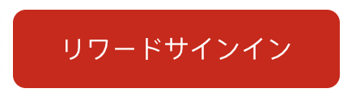
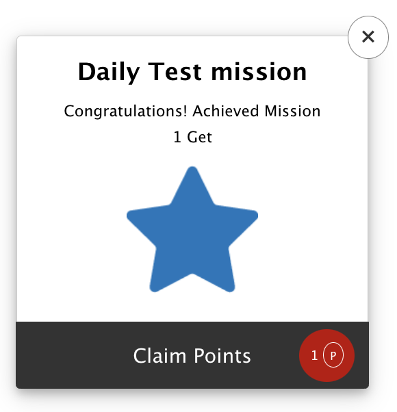
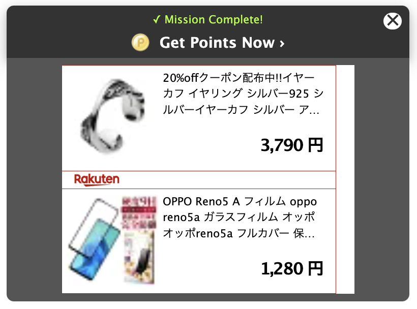
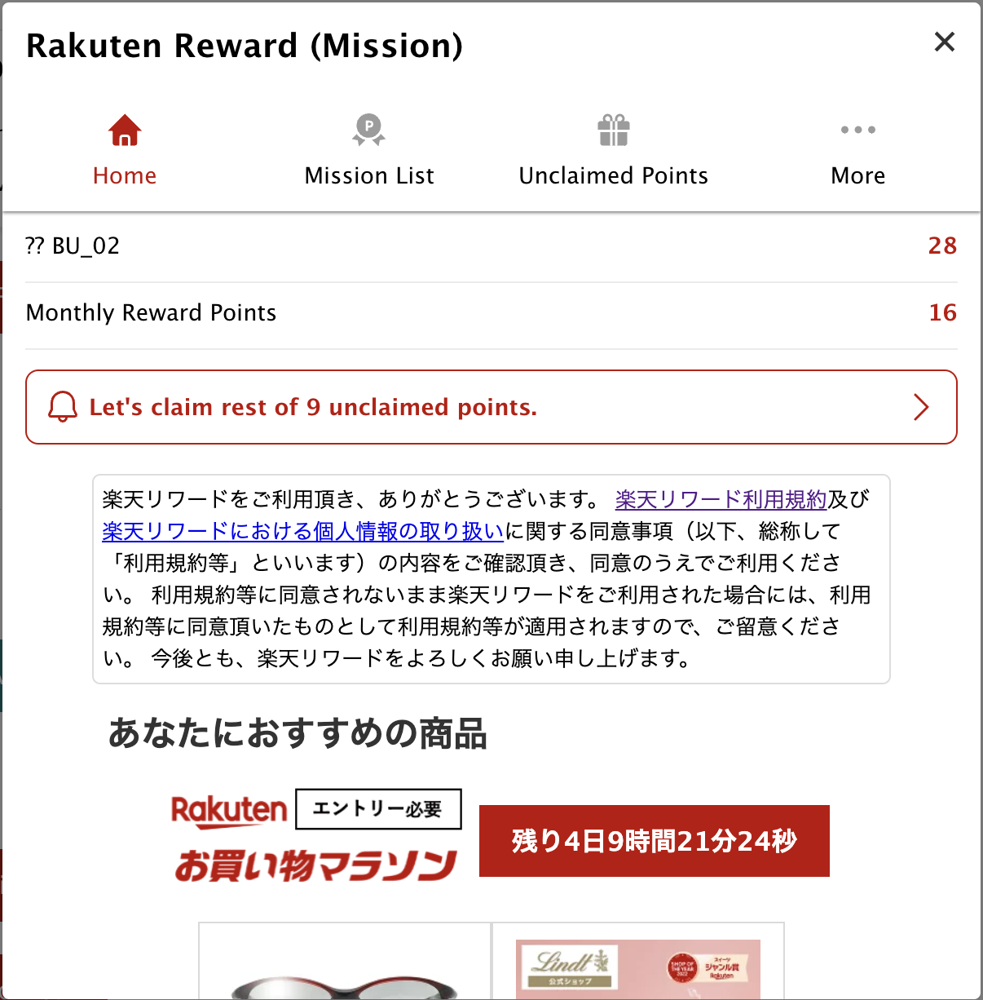

# `Rakuten Mission SDK - JS SDK`

[](https://developer.mozilla.org/en-US/docs/Web/JavaScript)
[](https://www.typescriptlang.org/docs/)

Reward Mission JS SDK is a javascript SDK for integrating with Reward Mission functionalities to let users get Rakuten Points as the reward of achieving missions.

Table of Contents

- [Prerequisites](#prerequisites)
- [Installation](#installations)
- [Initialize Mission SDK](#initialize-mission-sdk)
- [Get User Information](#get-user-information)
- [API Reference](./API.md)
- [FAQ](./FAQ.md)

<br /><br />

# `Prerequisites`

## `Browser Support`

Mission JS SDK uses Native Browser `fetch` to connect and fetch data from the API. That's why Mission JS SDK supports below browsers:

| Browser | Version | Year |
| ------- | ------- | ---- |
| Chrome  | > 42    | 2015 |
| Edge    | > 14    | 2016 |
| Safari  | > 10.1  | 2017 |
| Firefox | > 39    | 2015 |

\*reference: [`fetch` browsers supported](https://caniuse.com/?search=fetch)

If you want to support older browsers, please provide and import the [`fetch` polyfills](https://www.npmjs.com/package/whatwg-fetch) in your websites.

## `Front End Framework`

Mission JS SDK doesn't use any Front End Framework (e.g. React, Vue, etc) to render and display the UI. But only uses Vanilla Javascript DOM manipulation. There shouldn't be any issue or conflict with your website's tech stack.

## `Users Have to Logged In to Rakuten`

Mission JS SDK requires users to logged in to Rakuten Auth first before being able to use SDK features. For handing the authentication, please refer to this [Authentication](#authentication) guideline.

## `Languages Supported`

Mission SDK supports 2 languages: `ja` (japanese) & `en` (english), but `ja` is the default language. You can set the language to be used during the Mission SDK `init` [Initialize Mission SDK](#initialize-mission-sdk).

## `Responsive UI`

Mission SDK supports both `Desktop` & `Mobile` website by reading the device's width and height viewport. Mission SDK will display UI (Notification Banner, SDK Portal, etc) depends on the user's platform automatically.

- Mobile: `width <= 768px`
- Desktop: `width > 768px`

<br /><br />

# `Installations`

## `Import file via script tag`

To install via script, import our JS SDK file by pasting the following `<script>` tag inside the `<header>` tag.

```html
<header>
	// ... put this before the end of header tag
	<script
		type="text/javascript"
		src="https://ad-proxy.reward.rakuten.co.jp/sdk-ad/resources/sdk/missionsdk.js"></script>
</header>
```

After pasting the script, Mission SDK JS will be available and can be accessed in the `window` object, through the `RewardMissionSDK` variable.

```html
<script>
	const rewardSDK = window.RewardMissionSDK || {};
</script>
```

## `Import package from npm`

// WIP. Please use above import

## `Initialize Mission SDK`

To use Mission SDK, you need to call our `init` function and pass the `Application Key` value for your website, given by Reward SDK team.

```javascript
const rewardSDK = window.RewardMissionSDK || {};

rewardSDK.init({
	appKey: "QWERTYUIOPASDFGHJKLZXCVBNM123456789",
	language: "ja",
});
```

| function | async | parameters                              | response type | description            |
| -------- | ----- | --------------------------------------- | ------------- | ---------------------- |
| init     | no    | [SDKInitParams](./API.md#sdkinitparams) | void          | Initialize Mission SDK |

The `init` function can receives multiple parameters, depends on your needs. Please visit this [SDKInitParams](./API.md#sdkinitparams) API Reference.

<br /><br />

# `Authentication`

There are two auth mechanisms provided by Mission JS SDK:

1. <b>SDK handles the login</b>. This authentication can be used if:

   - Not internal Rakuten's websites
   - Haven't used Rakuten OMNI Auth
   - Don't have access to Tokens generated by Rakuten OMNI
   - Don't want to share the same login state with SDK

2. <b>You handle the login, and pass the login state to SDK</b>. This authentication can be used if:
   - You already used Rakuten OMNI Auth, and can acquire Refresh Token and Access Token to access RWDSDK API
   - You want the users to keep the login state in Mission SDK, without logging in again

## `SDK handles the login`

Mission SDK can handles the auth and login via Rakuten OMNI. This one will require users to re-login to Rakuten OMNI.

We provide several ways to login into Rakuten OMNI:

1. Redirect User to Rakuten OMNI to login.

```javascript
rewardSDK.openLoginUrl(); // calling this function will redirect users to login page
```

2. Get Rakuten OMNI's Login URL and handle the redirection by yourself. This one is useful if you want to display the login button or components by yourself.

```javascript
const loginUrl: string = rewardSDK.getLoginUrl(); // calling this function will return login URL and redirect users back to the current page
window.location.href = loginUrl;
```

3. Display our default Login Button. But, you need to prepare the html `div` tag (and define the `id` property) as a placeholder for our Login Button element.



```javascript
const elementId = "sdk-login-button-element-id";
rewardSDK.displayLoginButton(elementId); // calling this function will fill the 'sdk-login-button-element-id' element with SDK Login Button
```

## `Pass the Login State to SDK`

In order to use your existing API-C Tokens to connect with Mission JS SDK, you have to apply your API-C client to our Scope by following this step by steps:

1. Visit API-C Scope page
2. Create client or use your existing client.
3. Search for our scope and apply. Scope Name: `mission-sdk`, Organization: `Reward SDK`.
4. Mission SDK Team will approve it.

If you already have Refresh Token and Access Token from Rakuten OMNI and want to keep the login state between your website and Mission SDK, you can pass the Access Token and Refresh Token when initializing the SDK.

To use this feature and to make sure all the functionalities work (including refresh access token when expired), you have to pass several data: `accessToken`, `refreshToken`, and `userName` during the Mission SDK initialization. Please see the init function's parameters here [SDKInitParams](./API.md#sdkinitparams).

```javascript
rewardSDK.init({
	appKey: "QWERTYUIOPASDFGHJKLZXCVBNM123456789",
	language: "ja",
	accessToken: "QWERTYUIOPASDFGHJKLZXCVBNM123456789",
	refreshToken: "QWERTYUIOPASDFGHJKLZXCVBNM123456789",
	userName: "John Doe",
});
```

Notes:

1. Make sure that your `accessToken` has access to RWDSDK API in API-C.
2. Passing `refreshToken` is required, and will be used to automatically refresh the `accessToken` if the previous token is expired.
3. Passing `userName` is required, and will be used to display the User's Name in Mission SDK Portal.

<br /><br />

# `Get User Information`

## `Get Login Status`

```javascript
await rewardSDK.hasUserSignedIn(): Boolean
```

| function        | async | parameters | response type | description                         |
| --------------- | ----- | ---------- | ------------- | ----------------------------------- |
| hasUserSignedIn | yes   | no         | boolean       | User's login status (true or false) |

Usage Example:

```javascript
// async/await supported
const isSignedIn = await rewardSDK.hasUserSignedIn();

// Promise-based
rewardSDK.hasUserSignedIn().then((isSignedIn) => {
	console.log(isSignedIn);
});
```

## `Get User's Full Name`

```javascript
rewardSDK.getUserName(): String
```

| function    | async | parameters | response type | description                     |
| ----------- | ----- | ---------- | ------------- | ------------------------------- |
| getUserName | no    | no         | string        | User's full name (ex. John Doe) |

Usage Example:

```javascript
const userFullName = rewardSDK.getUserName();
```

## `Get User's Point Information`

```javascript
await rewardSDK.getUserInfo(): UserPointInformation
```

| function    | async | parameters | response type                                         | description              |
| ----------- | ----- | ---------- | ----------------------------------------------------- | ------------------------ |
| getUserInfo | yes   | no         | [UserPointInformation](./API.md#userpointinformation) | User's point information |

Usage Example:

```javascript
// async/await supported
const userPointInformation = await rewardSDK.getUserInfo();

// Promise-based
rewardSDK
	.getUserInfo()
	.then((userPointInformation) => {
		const { unclaimedPoints, currentPoints } = userPointInformation;
	})
	.catch((err) => {
		// failed to get user points info
	});
```

## `Log Out`

```javascript
rewardSDK.logout(options?: SDKCallbackParams): Void
```

| function | async | parameters                                                 | response type | description |
| -------- | ----- | ---------------------------------------------------------- | ------------- | ----------- |
| logout   | yes   | [SDKCallbackParams](./API.md#sdkcallbackparams) (Optional) | void          | No response |

Usage Example:

```javascript
rewardSDK.logout();

// with callback
const successCallback = () => console.log("Log out success!");
rewardSDK.logout({ successCallback });
```

## `Start Session or Refresh Access Token`

```javascript
rewardSDK.startSession(options?: SDKCallbackParams): UserPointInformation
```

| function     | async | parameters                                                 | response type | description                                                  |
| ------------ | ----- | ---------------------------------------------------------- | ------------- | ------------------------------------------------------------ |
| startSession | yes   | [SDKCallbackParams](./API.md#sdkcallbackparams) (Optional) | void          | Return [UserPointInformation](./API.md#userpointinformation) |

Usage Example:

```javascript
// async/await supported
const userInformation = await rewardSDK.startSession();

// Promise-based
rewardSDK.startSession().then((userPointInformation) => {
	// do something
});

// with callback
const successCallback = (userInformation: UserPointInformation) =>
	console.log("Start Session success!");
rewardSDK.startSession({ successCallback });
```

<br /><br />

# `Mission Achievement`

## `Get Mission List`

```javascript
rewardSDK.getMissions(options?: SDKCallbackParams): MissionItem[]
```

| function    | async | parameters                                                 | response type                         | description          |
| ----------- | ----- | ---------------------------------------------------------- | ------------------------------------- | -------------------- |
| getMissions | yes   | [SDKCallbackParams](./API.md#sdkcallbackparams) (Optional) | [MissionItem](./API.md#missionitem)[] | List of Mission Item |

Usage Example:

```javascript
// async/await supported
const missionList = await rewardSDK.getMissions();

// Promise-based
rewardSDK
	.getMissions()
	.then((missionList) => {
		console.log(missionList);
	})
	.catch((err) => {
		// failed to get mission list
	});

// with callback
const successCallback = () => console.log("Get Mission List success!");
rewardSDK.getMissions({ successCallback });
```

## `Log Action`

To log action, you need to call Log Action API.

```javascript
rewardSDK.logAction(missionActionData: MissionActionData, options?: SDKCallbackParams): MissionCompleteResponse
```

| function  | async | parameters                                                                                                     | response type                                               | description                                     |
| --------- | ----- | -------------------------------------------------------------------------------------------------------------- | ----------------------------------------------------------- | ----------------------------------------------- |
| logAction | yes   | ([MissionActionData](./API.md#missionactiondata), [SDKCallbackParams](./API.md#sdkcallbackparams): [Optional]) | [MissionCompleteResponse](./API.md#missioncompleteresponse) | Return Mission Achievement Complete Information |

Usage Example:

```javascript
// async/await supported
await rewardSDK.logAction({ actionCode: "ABCDEFGH123" });

// Promise-based
rewardSDK
	.logAction({ actionCode: "ABCDEFGH123" })
	.then((achieveMissionResponse) => {
		console.log(achieveMissionResponse);
	})
	.catch((err) => {
		// failed to get achieve mission
	});

// with callback
const successCallback = () => console.log("Log Action success!");
rewardSDK.logAction({ actionCode: "ABCDEFGH123" }, { successCallback });
```

After achieving the mission, Notification Banner UI will be displayed. Mission SDK provides several types of Notification Banner:

1. Modal (No Ads)



2. Notification Banner (No Ads)


3. Notification Banner 50 (With 50px heigth Ads)


4. Notification Banner 250 (With 250px heigth Ads)



5. CUSTOM

You can create your own notification UI after achieving mission by calling your function after receiving the response from `logAction` function.

```javascript
// async/await supported
const achieveMissionResponse = await rewardSDK.logAction({ actionCode: "ABCDEFGH123" });
displayNotification(achieveMissionResponse);

// Promise-based
rewardSDK
	.logAction({ actionCode: "ABCDEFGH123" })
	.then((achieveMissionResponse) => {
		displayNotification(achieveMissionResponse);
	})
	.catch((err) => {
		// failed to achieve mission
	});
```

<br /><br />

# `Claim Point`

## Get Unclaimed Point List

```javascript
rewardSDK.getUnclaimedItems(options?: SDKCallbackParams): UnclaimedItem[]
```

| function          | async | parameters                                                 | response type                             | description            |
| ----------------- | ----- | ---------------------------------------------------------- | ----------------------------------------- | ---------------------- |
| getUnclaimedItems | yes   | [SDKCallbackParams](./API.md#sdkcallbackparams) (Optional) | [UnclaimedItem](./API.md#unclaimeditem)[] | List of Unclaimed Item |

Usage Example:

```javascript
// async/await supported
const unclaimedItems = await rewardSDK.getUnclaimedItems();

// Promise-based
rewardSDK
	.getUnclaimedItems()
	.then((unclaimedItems) => {
		console.log(unclaimedItems);
	})
	.catch((err) => {
		// failed to get unclaimed items
	});

// with callback
const successCallback = () => console.log("Get Unclaimed Items success!");
rewardSDK.getUnclaimedItems({ successCallback });
```

### Claiming Point

```javascript
rewardSDK.claimPointMission(pointActionData: PointActionData, options?: SDKCallbackParams): ClaimPointResponse
```

| function          | async | parameters                                                                                                | response type                                     | description          |
| ----------------- | ----- | --------------------------------------------------------------------------------------------------------- | ------------------------------------------------- | -------------------- |
| claimPointMission | yes   | ([PointActionData](./API.md#pointactiondata), [SDKCallbackParams](./API.md#sdkcallbackparams) (Optional)) | [ClaimPointResponse](./API.md#claimpointresponse) | Claim Point Response |

Usage Example:

```javascript
// async/await supported
const response = await rewardSDK.claimPointMission({
	actionCode: "ABCDEFG123",
	achievedDateStr: "20231231",
});

// Promise-based
rewardSDK
	.claimPointMission({
		actionCode: "ABCDEFG123",
		achievedDateStr: "20231231",
	})
	.then((claimPointResponse) => {
		console.log(claimPointResponse);
	})
	.catch((err) => {
		// failed to claim point
	});

// with callback
const successCallback = () => console.log("Claim Point success!");
rewardSDK.claimPointMission(
	{
		actionCode: "ABCDEFG123",
		achievedDateStr: "20231231",
	},
	{ successCallback }
);
```

<br /><br />

# `Points`

## Getting Point History

```javascript
rewardSDK.getPointHistory(options?: SDKCallbackParams): PointHistory[]
```

| function        | async | parameters                                                 | response type                           | description                                |
| --------------- | ----- | ---------------------------------------------------------- | --------------------------------------- | ------------------------------------------ |
| getPointHistory | yes   | [SDKCallbackParams](./API.md#sdkcallbackparams) (Optional) | [PointHistory](./API.md#pointhistory)[] | List of Point History in the last 3 months |

Usage Example:

```javascript
// async/await supported
const pointsHistory = await rewardSDK.getPointHistory();

// Promise-based
rewardSDK
	.getPointHistory()
	.then((pointsHistory) => {
		console.log(pointsHistory);
	})
	.catch((err) => {
		// failed to get points history
	});

// with callback
const successCallback = () => console.log("Get Points History success!");
rewardSDK.getPointHistory({ successCallback });
```

## Getting Current Points

```javascript
rewardSDK.getCurrentPoints(options?: SDKCallbackParams): CurrentPoints[]
```

| function         | async | parameters                                                 | response type                          | description   |
| ---------------- | ----- | ---------------------------------------------------------- | -------------------------------------- | ------------- |
| getCurrentPoints | yes   | [SDKCallbackParams](./API.md#sdkcallbackparams) (Optional) | [CurretPoints](./API.md#currentpoints) | Current Point |

Usage Example:

```javascript
// async/await supported
const currentPoints = await rewardSDK.getCurrentPoints();

// Promise-based
rewardSDK
	.getCurrentPoints()
	.then((currentPoints) => {
		console.log(currentPoints);
	})
	.catch((err) => {
		// failed to get current points
	});

// with callback
const successCallback = () => console.log("Get Current Points success!");
rewardSDK.getCurrentPoints({ successCallback });
```

<br /><br />

# `Open Reward SDK Portal`

## Opening Reward Portal



```javascript
rewardSDK.displaySDKPortal(tab?: String, options?: SDKCallbackParams): Void
```

| function         | async | parameters                                                                                                                | response type | description            |
| ---------------- | ----- | ------------------------------------------------------------------------------------------------------------------------- | ------------- | ---------------------- |
| displaySDKPortal | no    | (tab: `('home', 'mission', 'unclaimed', 'poikatsu', 'more')`, [SDKCallbackParams](./API.md#sdkcallbackparams) (Optional)) | Void          | Open Reward SDK Portal |

Usage Example:

```javascript
rewardSDK.displaySDKPortal();
```

# Mission SDK User's Consent (Optional)

Mission JS SDK provides optional user's consent feature for Reward SDK's terms of use and privacy policy before they can access any Reward SDK features. It's up to each publishers if you want to enable this feature or not.

If user consent feature is enabled, users are required to give their consent when doing these:

- Open Reward SDK Portal
- Claim Point

User Consent popup will be displayed before they can complete above tasks if the users are still not consent yet.

## Get User Consent Status

```javascript
rewardSDK.getIsUserConsent(): Boolean
```

| function         | async | parameters | response type | description           |
| ---------------- | ----- | ---------- | ------------- | --------------------- |
| getIsUserConsent | no    | no         | boolean       | User's Consent Status |

Usage Example:

```javascript
const isUserConsent = rewardSDK.getIsUserConsent(); // true or false
```

## Accept User Consent

```javascript
rewardSDK.acceptConsent(options?: SDKCallbackParams): Void
```

| function      | async | parameters                                                 | response type | description         |
| ------------- | ----- | ---------------------------------------------------------- | ------------- | ------------------- |
| acceptConsent | yes   | [SDKCallbackParams](./API.md#sdkcallbackparams) (Optional) | void          | Accept User Consent |

Usage Example:

```javascript
const successCallback = () => console.log("Accept Consent success!");
rewardSDK.acceptConsent({ successCallback });
```

## Open User Consent's Popup


```javascript
rewardSDK.displayConsentPopup(options?: SDKCallbackParams): Void
```

| function            | async | parameters                                                 | response type | description               |
| ------------------- | ----- | ---------------------------------------------------------- | ------------- | ------------------------- |
| displayConsentPopup | yes   | [SDKCallbackParams](./API.md#sdkcallbackparams) (Optional) | void          | Open User Consent's Popup |

Usage Example:

```javascript
const successCallback = () => console.log("Open Consent Popup success!");
rewardSDK.displayConsentPopup({ successCallback });
```
