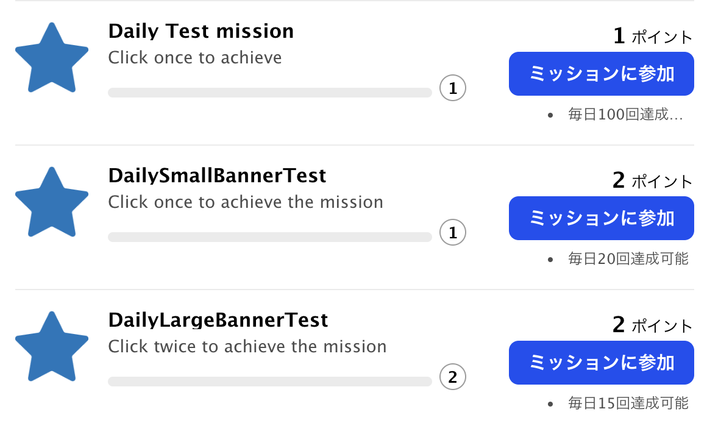
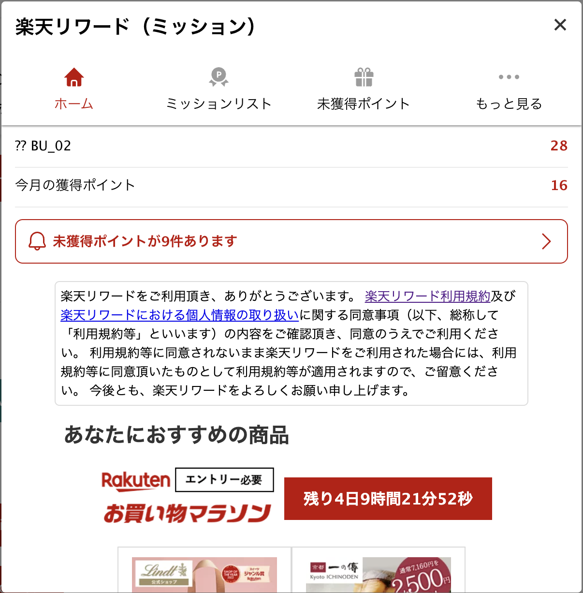

# `Mission SDK UI`

Table of Contents

- [Authentication](#authentication)
- [User](#user)
- [User Consent](#user-consent)
- [Point](#point)
- [Mission SDK Portal](#mission-sdk-portal)
- [Notification Popup](#notification-popup)

## Authentication

### Login Button

Display Rakuten Login Button that will redirect users to the Rakuten Login Page, and redirected back to the original URL after it.


`Note: This UI will fill the element's width, so please provide the proper width size, for example: 330px.`

How to use:

```javascript
const elementId = "sdk-login-button-element-id";
rewardSDK.displayLoginButton(elementId);
```

Reference: [Authentication UI](./API.md#authentication-ui)

## User

### User Information

If user is logged in, display User's Point Information. If user is not logged in, display Rakuten Login Button.


`Note: This UI will fill the element's width, so please provide the proper width size, for example: 330px.`

How to use:

```javascript
const elementId = "sdk-user-info-element-id";
rewardSDK.displayLoginElement(elementId);
```

Reference: [User UI](./API.md#user-ui)

In this UI, some informations are displayed:

1. User's Name (if any)
2. User's Current Rakuten Point
3. User's Monthly Reward Point from Mission SDK

## User Consent

### User Consent Popup

Display Mission SDK User's Consent Popup to let users accept the terms and conditions before using Mission SDK features.


`Note: This UI will be displayed as a popup within your domain. Clicking Terms of Service or Privacy Policy will open the link in new tab.`

How to use:

```javascript
rewardSDK.displayConsentPopup();
```

### User Consent Banner

Display Mission SDK User's Consent Banner to introduce notify users to give user consent, clicking the button will display above User Consent Popup.


How to use:

```javascript
rewardSDK.displayConsentBanner((isAccepted) => {
	console.log("isAccepted", isAccepted);
});
```

Reference: [User Consent API](./API.md#user-consent-ui)

## Mission

### Mission List

Display Mission List using the default UI, the same as Mission List in the Mission SDK Portal.


`Note: This UI will fill the element's width, so please provide the proper width size, for example: 700px.`

How to use:

```javascript
rewardSDK.displayMissionList();
```

Reference: [Mission UI](./API.md#mission-ui)

In this UI, some informations will be displayed:

1. Mission instruction
2. List of Mission Item
3. Mission Icon
4. Mission Name, ex. `Daily Test mission`
5. Mission Descriptions, ex. `Click once to achieve`
6. Mission Progress
7. Mission Point, ex. `2 points`
8. Mission Conditions, ex. `Every day 100 times achievable`
9. Join Mission Button\*
10. Terms and Conditions for Joining Mission\*
11. Leave Mission Button\*
12. Leave Mission Confirmation\*

`Note: Item 9 to 12 will only appear if mission subscription is enabled in developer portal`

Clicking the mission item will display Mission Item Details:


`Note: This UI will be displayed as a popup within your domain.`

If mission subscription is enabled in the developer portal, a join mission button will appear:



Clicking the Join Mission button will display Terms and Conditions Popup:


`Note: The terms and conditions message can be configured in the developer portal.`

When user has joined the mission, a 'Leave Mission' text button will be available:


Clicking the Leave Mission text will display a Confirmation Modal:


## Point

### Unclaimed Points List

Display Unclaimed Points List using the default UI, the same as Unclaimed Points List in the Mission SDK Portal.


`Note: This UI will fill the element's width, so please provide the proper width size, for example: 700px.`

How to use:

```javascript
rewardSDK.displayUnclaimedItems();
```

Reference: [Claim Points UI](./API.md#claim-points-ui)

In this UI, some informations will be displayed:

1. How to claim points instruction
2. List of Unclaimed Points Item
3. Mission Icon
4. Mission Name, ex. `DailySmallBannerTest`
5. Mission Descriptions, ex. `Click once to achieve the mission`
6. Mission Achievement Date, ex. `2023/08/30`
7. Mission Point, ex. `2 points`
8. Claim Point Button

### Claim Point Popup

Clicking the Claim Point Button will complete the mission and grant points to the user, and open Claim Point Popup:


`Note: This UI will be displayed as a popup within your domain.`

## Mission SDK Portal

### Mission SDK Portal Popup

Display Mission SDK Portal that has of several menus:

1. Home
2. Mission List
3. Unclaimed Points List
4. Others



`Note: This UI will be displayed as a popup within your domain.`

```javascript
rewardSDK.displaySDKPortal();
```

Reference: [Mission SDK Portal](./API.md#mission-sdk-portal-ui)

In this SDK Portal UI, users will be able to do these:

`Home Tab`

1. See current points and earned points
2. See ads

`Mission List Tab`

1. See the list of mission items
2. See the progress of each mission
3. See the details of each mission

`Unclaimed Points Tab`

1. See the list of unclaimed points
2. See the achieved mission details
3. Claim point

`Others`

1. See the Points History (up to 3 months)
2. Change the Notification UI setting, to not display Notification Banner after achieving mission.
3. Open Mission SDK's Terms of Usage Page
4. Open Mission SDK's Privacy Policy page
5. Open Mission SDK's Help Page

## Notification Popup

After achieving mission, Notification Popup will be displayed to the users. Which Notification Popup will be displayed depends on the Mission's configuration in the Mission SDK's Developer Portal.

### Notification Modal (MODAL)


### Notification Banner No Ads (BANNER)


### Notification Banner 50 (BANNER_50)


### Notification Banner 50 (BANNER_250)


